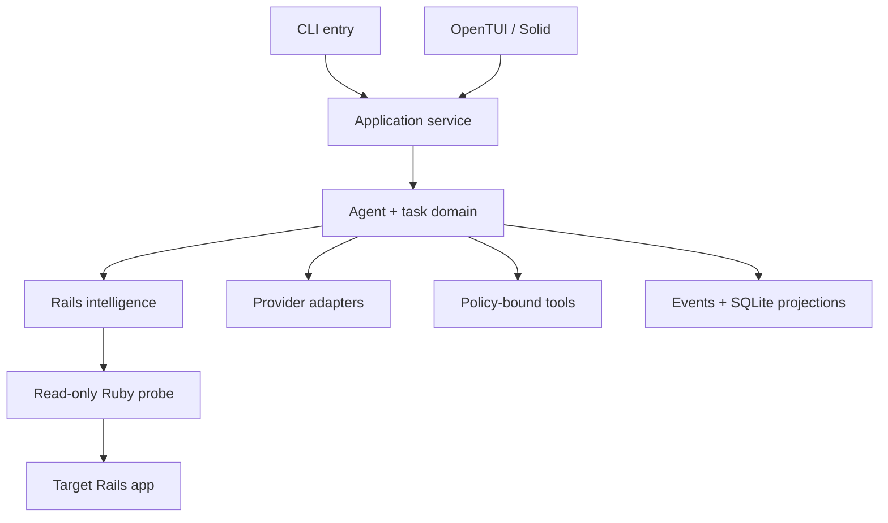
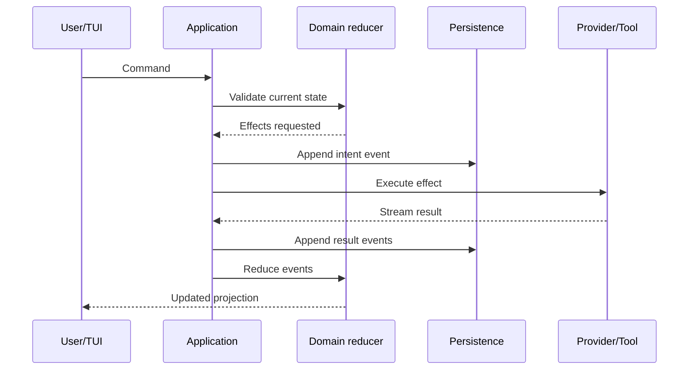

# Mavona v2 Architecture

**Status:** Recommended architecture
**Date:** 6 September 2026 · specification revision 5

## 1. Decision

Build Mavona as one TypeScript 7.0/Bun application with a shared domain core and two presentation adapters:

- OpenTUI + SolidJS for interactive use;
- text/JSON/JSONL for headless use.

Invoke a small, versioned Ruby probe as a subprocess only for Rails runtime introspection. Do not retain a Ruby application core, introduce a TypeScript-to-Ruby UI protocol or port a TUI framework.



## 2. Why this architecture

1. Mavona avoids depending on an immature Ruby TUI framework without building its own.
2. OpenTUI supplies the native Zig renderer, component tree, flex layout, input and test surfaces; Solid supplies reactive composition.
3. The agent loop and TUI share one event bus, removing a needless cross-runtime protocol from the hot interactive path.
4. Rails still evaluates runtime facts in the only authoritative environment: the target application's Ruby, Bundler and Rails.
5. Headless operation stays first-class because domain state does not live in Solid components.
6. Bun can compile the application and OpenTUI assets into standalone executables, subject to per-target release verification.

## 3. Package layout

```text
apps/
  mavona/                 composition root and executable entry
packages/
  protocol/               schemas, event IDs, versions, codecs
  domain/                 task/session state machines and reducers
  agent/                  provider-neutral loop and context lifecycle
  rails/                  static analysis, task analysis, probe client
  providers/              API, compatible, local and subscription adapters
  tools/                  tool schemas, policy, execution, output artifacts
  verification/           verifier selection, execution and evidence
  app-inspection/         Playwright adapter, flows, capture and browser lifecycle
  sessions/               event log, SQLite projections, resume/compaction
  tui/                    OpenTUI/Solid presentation
  cli/                    commands and headless projections
  testing/                fake providers, clocks, fixtures and PTY helpers
probes/
  rails_probe.rb
fixtures/
  rails-dogfood/
eval/
  public/
  protected-manifest/     metadata only; grader bodies live outside agent view
```

Packages may depend inward on `protocol` and domain interfaces. `domain`, `rails`, `providers`, `tools`, `verification` and `sessions` must not import `tui`.

## 4. Runtime topology

### Interactive

One Bun process owns:

- terminal IO and OpenTUI lifecycle;
- application service and event dispatch;
- agent loop;
- provider streams;
- tool child processes;
- SQLite and event-log persistence.

The Rails probe and repository commands are child processes in separate process groups. They receive a controlled environment and independent stdout/stderr capture.

### Headless

The same application service runs without importing or initializing the renderer. A headless projector writes text, a final JSON document or JSONL events. No pseudo-terminal is required unless a specific approved tool explicitly declares it.

### Future remote clients

The internal event schema may later support a separate client, but v2 must not add sockets, daemon discovery or remote authentication merely for hypothetical extensibility.

## 5. State ownership

The application service is the sole command dispatcher. Domain reducers are the authority for session/task state. Solid signals hold only UI projections such as focus, viewport and transient modal state.



UI code cannot mark a task verified, execute tools, store credentials or edit the repository directly.

## 6. Event protocol

Evidence is a validated discriminated union keyed by kind: repository_fact, convention, impact, verifier_recommendation, legibility, verification, app_observation and app_assertion. Define concrete observation schemas per variant, with stable IDs, session/task, subject, confidence basis, source references and provenance. Assertion variants require check/inspection identity and passed/failed/unknown; captures require artifact IDs and capture metadata. Raw unknown inputs terminate at adapters or opaque quarantine records, never unvalidated domain fields. Unsupported correctness-bearing variants cannot authorize completion.


### Envelope

```ts
type EventEnvelope<T extends EventPayload = EventPayload> = {
  protocolVersion: 1
  eventId: string
  sessionId: string
  taskId?: string
  sequence: number
  timestamp: string
  type: T["type"]
  payload: Omit<T, "type">
  causedBy?: string
  schemaVersion: number
}
```

Required event families:

- session opened, resumed, compacted, cancelled and closed;
- user message and assistant text/reasoning status;
- discovery, task route, plan and plan-step update;
- tool requested, approval requested/resolved, tool started/progress/completed;
- file changed and diff produced;
- Rails finding and legibility finding;
- inspection started/stopped, browser action requested/completed, capture recorded, assertion completed, takeover and comparison produced;
- verifier selected/started/completed and evidence recorded;
- provider selected, capability observed and usage reported;
- recoverable error, fatal error and checkpoint;

### Ordering

- `sequence` is assigned synchronously by the session writer before append.
- Event IDs are stable UUIDv7/ULID-style identifiers; IDs are never derived from mutable display text.
- Provider chunks may arrive concurrently with process output, but the dispatcher serializes durable events.
- Rendering may coalesce adjacent text deltas; storage preserves their logical order.
- Duplicate delivery is ignored by `eventId`.
- A result references its request through `causedBy` and stable domain IDs.

### Compatibility

- `protocolVersion` versions the envelope fields, ordering and framing. Reject an unsupported major envelope version before normal replay.
- `schemaVersion` versions the payload for a particular `type`; decode by `(type, schemaVersion)`. Additive optional changes need no bump; incompatible payload changes do. Envelope changes do not require bumping every payload. The literal `1` denotes the current writer format.
- Unknown event types or payload versions are retained and skipped by older display projectors, but safety-critical replay refuses mutation/completion if it cannot understand required state. Never skip an unknown approval event and continue writing.
- A reader rejects a newer incompatible envelope version with an actionable upgrade message.
- Additive optional payload fields are allowed within a schema version.
- Breaking payload changes create a new event schema version and explicit migration/projector support.

## 7. Persistence

Use an append-only JSONL log as the recovery source and SQLite as the indexed projection.

```text
user config: OS-appropriate config directory/config.json
credentials: environment, memory or OS secure store
sessions: OS-appropriate data directory/sessions/<id>/events.jsonl
database: OS-appropriate data directory/mavona.sqlite3
artifacts: sessions/<id>/artifacts/
project: .mavona.yml, .mavona/locks and private .mavona/recovery source entries
```

Writes use append, flush policy and atomic checkpoint replacement. On startup:

1. validate the last complete JSONL record;
2. truncate only an incomplete trailing record;
3. replay from the latest compatible checkpoint;
4. reconcile SQLite projection offsets;
5. compare stored repository/worktree fingerprint with current Git state.

A separate durable pending-effect record under the worktree lock directory survives loss of the owning process and blocks other sessions before mutation. Record canonical intent and the worktree guard before executing an effect; persist the canonical result before clearing the guard. Unknown outcomes retain it. Explicit reconciliation by the owning session records an explanation and accepts the current repository/application state without changing an unknown outcome into success. Invalidate prior verification, then clear the guard. Reconciliation never replays the effect.

Compaction creates a summary artifact and checkpoint event; it never destroys the original evidence needed for audit until an explicit retention policy permits archival.

See `docs/specs/RETENTION.md` for artifact budgets, archival and explicit evidence expiry. Discovery cache is stored alongside rebuildable SQLite projections, never mixed with credentials.

## 8. Rails intelligence boundary

### Three cost tiers

| Tier | Responsibility | Execution |
| --- | --- | --- |
| 1 | Git, file inventory, data-only lockfile/YAML/SQL inspection, naming heuristics, scoring and selection | TypeScript, no target runtime |
| 2 | Declared Ruby classes/modules, associations, validations, callbacks, actions and constants | No-boot parser adapter: Prism candidate versus Tree-sitter candidate |
| 3 | Resolved routes, effective configuration, resolved Zeitwerk paths and runtime associations/schema facts | Explicit target Ruby/Bundler Rails boot |

Milestone 0 measures a no-boot Prism subprocess against the current/reference structural approach. Parser selection is pending that ADR; do not implement two full semantic analyzers in advance. Tree-sitter may remain useful for TUI highlighting independently of the Rails fact parser. `schema.rb` and Ruby configuration are code: parse them, never evaluate them in Tier 1.

No-boot means no application requires, Bundler setup, initializers or user Ruby evaluation. It still requires a working configured Ruby executable and compatible parser; neither is guaranteed by having a checkout. Support configured container execution where already declared, or degrade to Tier 1 with explicit unknown structural facts. Do not silently install gems into the target app. Probe availability/version first; test older-Ruby and Docker-only fixtures. Distinguish syntactic declarations from effective runtime behavior.

### Probe execution

A versioned request specifies allowlisted `parse` or `runtime` operation, allowed paths and resource bounds. Copy the probe to a private directory and invoke configured argv without shell interpolation. The parse path loads only its pinned parser. The runtime path normally uses the target bundle. Both return validated JSON on stdout and diagnostics on stderr, with size/time limits and cancellation.

The probe itself never mutates the application. Booting application initializers can nonetheless execute application code and cause side effects. A read-only probe is not a sandbox. Disclose boot, sanitize inherited environment and run against an isolated dev/test configuration; if isolation cannot be established, require policy authorization or remain in lower tiers. Never promise that arbitrary Rails boot is intrinsically free of writes/network/jobs.

### Discovery cache

Persist versioned per-file structural entries keyed by content digest, parser version and query-schema version. Recompute aggregate routing facts when relevant membership, configuration, ignored paths or instruction scope changes. Git status is a signal, not the only invalidator; include untracked files and renames. Runtime entries additionally include Ruby/Bundler versions, relevant environment/configuration digest, schema/fixture revision when known and expiry. Unknown dependencies force recomputation. Never persist secret environment values.

Cached findings expose capture time and cache provenance. Startup may show cached facts while refreshing, but cannot route or mutate from known-stale required facts. Acceptance: unchanged restart reuses facts; unrelated saves preserve valid file entries; route/config/schema changes invalidate dependent facts; failed refresh produces unknown rather than a fabricated fresh observation.

## 9. Provider architecture

```ts
interface ProviderAdapter {
  readonly id: string
  readonly locality: "local" | "remote" | "subscription"
  connectionMethods(): ConnectionMethod[]
  status(signal: AbortSignal): Promise<ConnectionStatus>
  listModels(signal: AbortSignal): Promise<ModelDescriptor[]>
  capabilities(model: ModelDescriptor, signal: AbortSignal): Promise<ModelCapabilities>
  stream(request: ModelRequest, signal: AbortSignal): AsyncIterable<ProviderEvent>
  disconnect(): Promise<void>
}
```

OpenAI-compatible and Anthropic wire formats terminate inside adapters. The agent consumes normalized content deltas, tool-call deltas, usage, completion and error events. Capability evidence records whether a feature came from trusted preset metadata, provider metadata, bounded preflight or user override.

Provider adapters do not execute tools or approve actions. Subscription adapters must satisfy the same interface beneath Mavona's agent loop; a provider-owned autonomous agent does not qualify.

## 10. Agent loop

The loop is a cancellable state machine with explicit limits:

```text
prepare context
→ request model
→ accumulate normalized deltas
→ validate complete tool calls
→ request/resolve policy approval
→ execute bounded tools
→ append results
→ repeat within tool-step/time/token budgets
→ verify independently
```

Malformed tool JSON, unnamed tools, unsupported capabilities and budget exhaustion produce typed events. Provider cancellation uses `AbortController`; command cancellation signals the process group, escalates after a grace period and records the observed outcome.

## 11. Tool and process security

- Canonicalize the selected worktree and verify containment before and after symlink resolution.
- Separate read, write, execute, network and destructive capabilities.
- Prefer argument arrays. Shell evaluation requires an explicit tool/schema and higher-risk approval.
- Use output byte/time limits and artifact spillover.
- Strip provider credentials from child environments unless the child is the selected provider bridge and the contract requires them.
- Never forward arbitrary `BUN_OPTIONS`, preload hooks or debugging variables into controlled subprocesses.
- Redact known credentials and common bearer/key patterns before persistence and display.
- Treat repository instructions and tool output as untrusted data, not authority to change Mavona policy.

## 12. Verification architecture

Verifier candidate selection uses project configuration first, then evidence-backed repository defaults. Candidate precedence never grants execution authority. Every selected verifier passes the configuration-trust and execution policy in `docs/specs/THREAT_MODEL.md`, including cache hits and resumed sessions. Every verifier has identity, command/args, scope, rationale, timeout and required/optional status.

Results include:

- `passed | failed | unknown` semantic state;
- exit status or signal;
- start/end timestamps and duration;
- bounded stdout/stderr plus artifact references;
- repository fingerprint;
- evidence sources and selection rationale.

Baseline/result caching is optional optimization after correctness. If enabled, key by repository SHA, dirty-state digest, verifier identity, environment/configuration and fixture/database-state revision. Unknown mutable state disables reuse. This conservative key intentionally invalidates on edits; repeated checks of identical state can reuse evidence. A pre-change baseline is labelled historical and cannot verify post-change code. Do not key only on nominal test paths without a proven dependency closure. Cache-hit provenance is visible; cache reuse never overrides required freshness. Omit the optimization if measured benefit is negligible.

## 13. App Inspection architecture

The application service dispatches policy-bound inspection effects to `app-inspection`. Its narrow interface and evidence schema are defined in `docs/specs/APP_INSPECTION_SPEC.md`. It owns Playwright browser contexts, server ownership, flow execution, capture and artifact sanitization. It does not own the agent loop or completion truth. `verification` consumes typed assertion results; `sessions` persists events and artifacts; TUI/CLI render projections. Neither Solid nor provider adapters call Playwright directly.

Browser/driver processes are external-effect children, like the Rails probe. The core and TUI remain one TypeScript process. CPU-heavy image comparison runs in a bounded worker so it cannot stall the composer. Binary artifacts are written atomically and hash-addressed; events contain references, not base64 payloads. Partial capture cannot become completed evidence. Resume replays observations without replaying actions.

Release packaging must prove the Playwright driver/runtime and separately installed browsers work with the compiled executable. Keep exact engine/driver versions together. Browser install, offline cache and OS dependency diagnostics are required distribution paths. See the App Inspection specification for egress, credential isolation, trace sanitization and fixture-state rules.

## 14. TUI boundary

OpenTUI/Solid consumes read-only selectors and sends typed commands. Mavona-specific components include transcript, composer, tool card, diff viewer, approval overlay, Rails evidence drawer, plan view, verification panel, model picker and session picker.

Do not wrap all OpenTUI APIs in a fake framework. Isolate them at screen/component and renderer-lifecycle seams so domain code remains independent. A narrow `TerminalDriver` is appropriate for lifecycle, tests and fatal cleanup; recreating layout, focus or rendering abstractions is not.

## 15. Source viewer boundary

TUI file-open commands go through a bounded repository-read service and return a revision-tagged snapshot. UI state owns focus, selection and viewport; the application service owns authorization, path containment and prompt attachment construction. Opening a file is local presentation activity and does not call a model. A selected reference carries path, range and digest so submission can detect source drift.

External-editor handoff is an application effect with a quiescent mutation boundary, validated argv and terminal lifecycle support. The application retains its worktree lock, reconciles filesystem changes on return and invalidates stale approvals/evidence. Do not introduce an embedded editor or independent source buffer authority.

## 16. Packaging

Use Bun workspaces and lock dependencies exactly for release builds. At the time of this design, OpenTUI Solid requires an exact SolidJS peer version, so upgrades must be coordinated and tested.

Standalone builds must:

- embed the matching OpenTUI native core and runtime assets;
- build separate macOS arm64/x64 and Linux arm64/x64 artifacts;
- select glibc or musl at build time for Linux;
- run on target-native CI or release hosts;
- verify startup, rendering, Ruby probe invocation, resume and terminal cleanup from the packaged executable;
- publish checksums, provenance and an SBOM;
- avoid requiring Bun or package installation on the user's machine.

## 17. Failure handling

| Failure | Required behavior |
| --- | --- |
| Rails app cannot boot | Preserve static facts; runtime fields become `unknown` |
| Provider disconnects | Keep draft and session; offer retry with the same route; no fallback |
| Tool crashes | Record exit/signal/output; agent may respond within repair budget |
| TUI exception | Flush fatal event when possible, restore terminal and print recovery command |
| Native renderer crash | OS restores process-owned terminal where possible; next launch detects interrupted session |
| Event log trailing corruption | Remove only incomplete trailing record and replay |
| Worktree changed externally | Block mutation until reconciliation |
| Credential store unavailable | Use environment or session-only entry; never plaintext persistence |
| Unsupported model tools | Refuse task execution and offer model selection |

## 18. Architecture decisions superseding the Ruby prototype

- **A001:** TypeScript 7.0 replaces Ruby as the application implementation language.
- **A002:** Bun is the supported runtime/build tool; users receive compiled executables.
- **A003:** OpenTUI Core + Solid is selected; Mavona does not build or port a TUI framework.
- **A004:** UI and agent core share a process, but domain state is UI-independent.
- **A005:** Ruby remains only as a read-only target-project probe.
- **A006:** SQLite projections plus append-only JSONL replace loose per-task JSON as the primary session store; export remains JSON.
- **A007:** Provider and evidence semantics from the prototype are preserved unless the new spec explicitly changes them.
- **A008:** Existing Ruby behavior is reference evidence, not a compatibility obligation; parity is accepted behavior by behavior.

## 19. Open decisions

1. SQLite driver compatible with Bun standalone builds, chosen by a packaging spike.
2. Exact secure-store implementation per platform.
3. Whether syntax highlighting uses OpenTUI's Tree-sitter facilities or a separate pure TypeScript highlighter.
4. Clipboard integration defaults and privacy messaging.
5. Windows support milestone after first-class macOS/Linux delivery.
6. Exact Playwright driver packaging and sanitized trace strategy; full App Inspection is required scope, not an open product decision.

## 20. Reference versions for the first spike

Pin, do not float:

- `typescript` 7.x exact stable release selected by the lockfile;
- Bun minimum compatible with the pinned OpenTUI release;
- independently pinned `@opentui/core` and `@opentui/solid` versions whose declared constraints and packaged integration tests pass;
- the exact `solid-js` peer version required by that OpenTUI Solid release.

Earlier research observed Core 0.5.10 and Solid 0.5.9, with an exact SolidJS peer requirement. These are research inputs, not a dependency lock. Inspect current package manifests and pin a compatible combination plus Bun. Treat native platform package layouts as internal distribution details and revalidate packaged loading on upgrades.

TypeScript 7.0 does not provide the programmatic compiler API. Inventory lint, codegen, transforms and build tools that import it; verify each exact dependency. Use documented TypeScript 6 compatibility tooling where required while retaining TypeScript 7 for application typechecking. Record the tested arrangement in an ADR, never infer API compatibility from successful transpilation.

See `docs/specs/THREAT_MODEL.md`, `docs/specs/RETENTION.md`, `docs/specs/PARITY.md` and `docs/adr/001-typescript-application.md` for the supporting contracts.

Reference documentation:

- [Ruby 3.3 Prism introduction](https://www.ruby-lang.org/en/news/2023/12/25/ruby-3-3-0-released/)
- [Ruby 3.4 default parser](https://www.ruby-lang.org/en/news/2024/12/25/ruby-3-4-0-released/)
- [TypeScript 7.0 announcement](https://devblogs.microsoft.com/typescript/announcing-typescript-7-0/)
- [OpenTUI getting started](https://opentui.com/docs/)
- [OpenTUI Solid package](https://opentui.com/packages/opentui-solid/)
- [OpenTUI runtime and platform support](https://opentui.com/docs/getting-started/runtime-support/)
- [OpenTUI standalone executables](https://opentui.com/docs/reference/standalone-executables/)
- [Bun standalone executable documentation](https://bun.sh/docs/bundler/executables)
